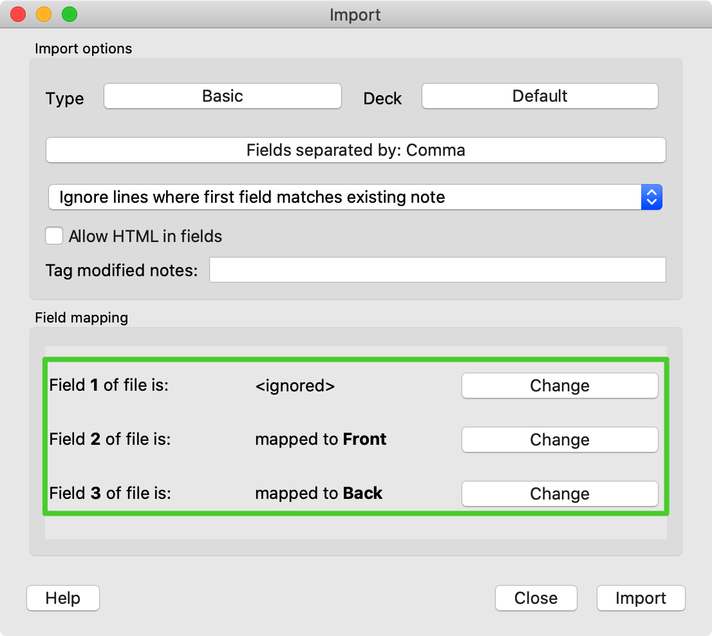

# BulkImportToAnk
An example to demonstrate how to import Anki cards in a batch.

## Usage 
Using 
```bash
python convert2csv.py
```
You can convert the PDF to a csv file `DataExportToAnki.csv`. 

Then, on your computer, open `Anki-> File -> Import`, and then choose the csv file.



Then, done. Thanks for using this. 
